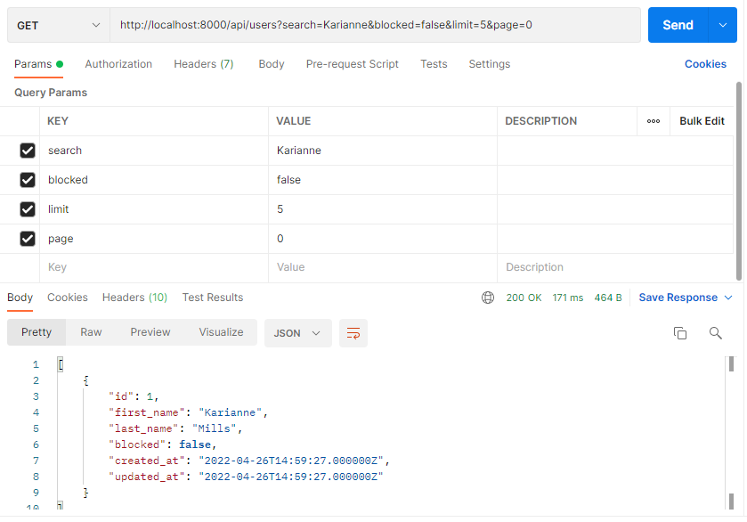
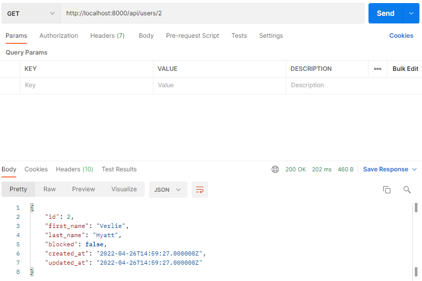
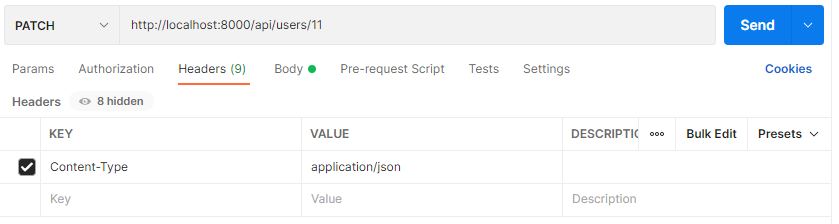
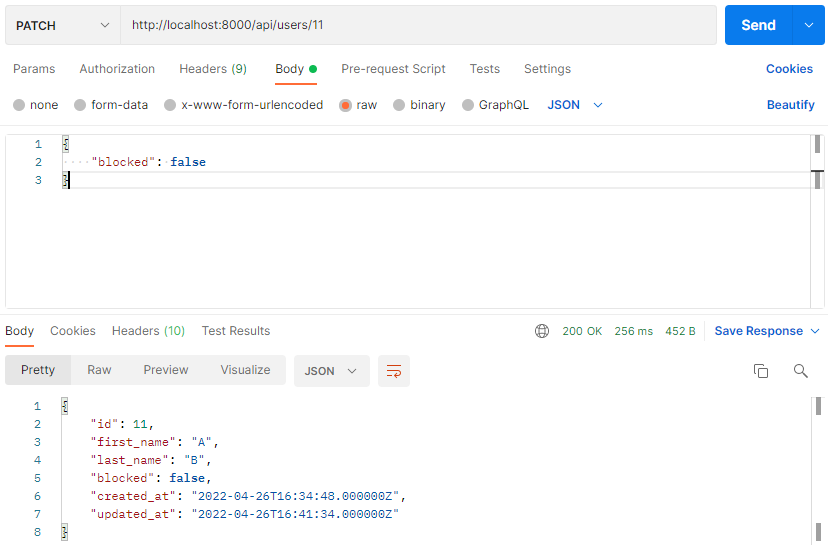
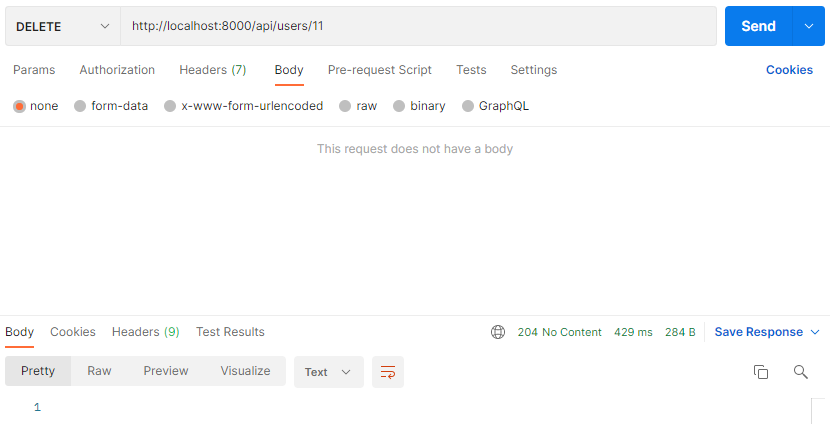
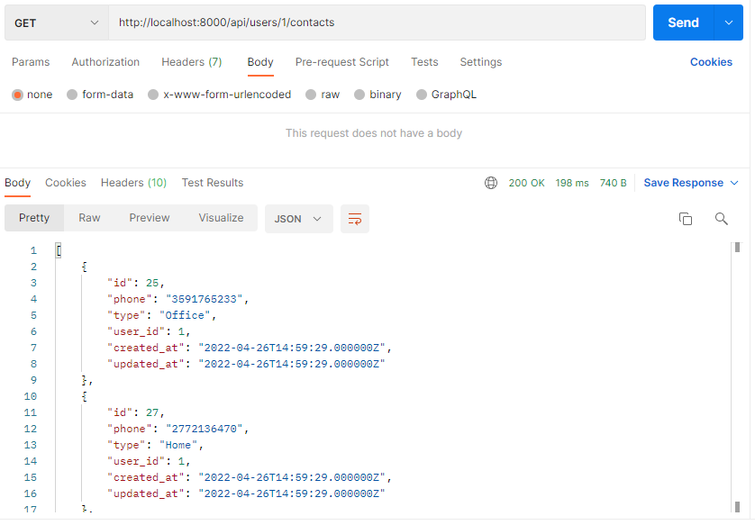

# Deployment

## Create database

Create database with name `laravel` in your local MySQL.

## Configure environment variables

Clone `.env.example` in root directory and rename it to `.env`.

If needed, please change `DB_USERNAME` or `DB_PASSWORD`.

## Seed Database

Run the following command to prepare the faker data.

`php artisan db:seed`

## Launch API Server

Run the following command to launch this api server.

`php artisan serve`

PHP Development Server will be started on `8000` port.

# Testing

Use Postman to test this api server.
API document is `api-doc.yml` in root directory.

## Index Action

`GET` method

`http://localhost:8000/api/users`
`http://localhost:8000/api/contacts`

## Show Action

`GET` method

`http://localhost:8000/api/users/2`
`http://localhost:8000/api/contacts/2`

## Create Action

`POST` method, `form-data` body

`http://localhost:8000/api/users`
`http://localhost:8000/api/contacts`

## Update Action

`PATCH` method, `raw` body, `application/json` Content-Type

`http://localhost:8000/api/users/11`
`http://localhost:8000/api/contacts/31`

## Delete Action

`DELETE` method

`http://localhost:8000/api/users/11`
`http://localhost:8000/api/contacts/31`

`204` status code will be returned.

## Complex Action

`GET` method

`http://localhost:8000/api/users/1/contacts`

